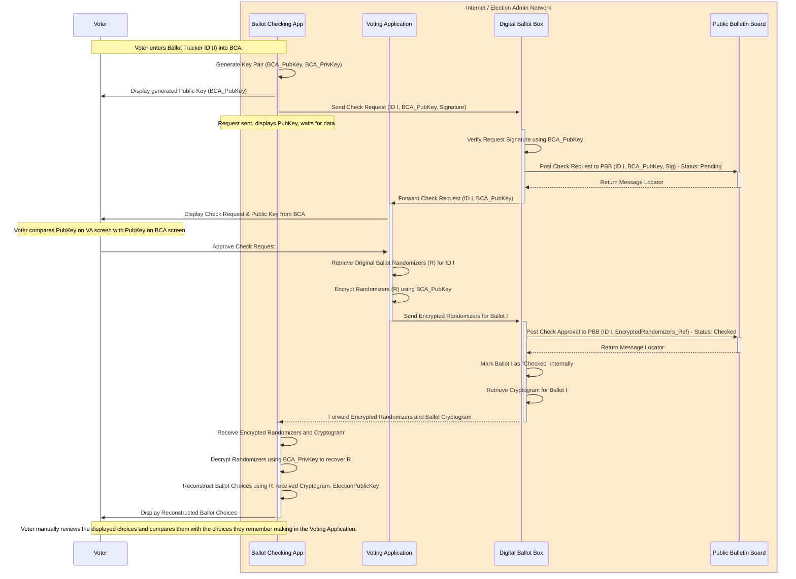

# Ballot Check Subprotocol Sequence Diagram

```mermaid
sequenceDiagram
        participant Voter
    box rgb(255, 235, 204) Internet / Election Admin Network
        participant BCA as Ballot Checking App
        participant VA as Voting Application
        participant DBB as Digital Ballot Box
        participant PBB as Public Bulletin Board
    end

    Note over Voter, BCA: Voter enters Ballot Tracker ID (I) into BCA.
    activate BCA
    BCA->>BCA: Generate Key Pair (BCA_PubKey, BCA_PrivKey)
    BCA->>Voter: Display generated Public Key (BCA_PubKey)
    BCA->>+DBB: Send Check Request (ID I, BCA_PubKey, Signature)
    Note over BCA: Request sent, displays PubKey, waits for data.

    activate DBB
    DBB->>DBB: Verify Request Signature using BCA_PubKey
    DBB->>+PBB: Post Check Request to PBB (ID I, BCA_PubKey, Sig) - Status: Pending
    PBB-->>-DBB: Return Message Locator
    DBB->>+VA: Forward Check Request (ID I, BCA_PubKey)
    deactivate DBB

    activate VA
    VA->>Voter: Display Check Request & Public Key from BCA
    Note over Voter: Voter compares PubKey on VA screen with PubKey on BCA screen.
    Voter->>VA: Approve Check Request
    VA->>VA: Retrieve Original Ballot Randomizers (R) for ID I
    VA->>VA: Encrypt Randomizers (R) using BCA_PubKey
    VA->>+DBB: Send Encrypted Randomizers for Ballot I
    deactivate VA

    activate DBB
    DBB->>+PBB: Post Check Approval to PBB (ID I, EncryptedRandomizers_Ref) - Status: Checked
    PBB-->>-DBB: Return Message Locator
    DBB->>DBB: Mark Ballot I as "Checked" internally
    DBB->>DBB: Retrieve Cryptogram for Ballot I
    DBB-->>BCA: Forward Encrypted Randomizers and Ballot Cryptogram
    deactivate DBB

    activate BCA
    BCA->>BCA: Receive Encrypted Randomizers and Cryptogram
    BCA->>BCA: Decrypt Randomizers using BCA_PrivKey to recover R
    BCA->>BCA: Reconstruct Ballot Choices using R, received Cryptogram, ElectionPublicKey
    BCA->>Voter: Display Reconstructed Ballot Choices
    deactivate BCA

    Note over Voter, BCA: Voter manually reviews the displayed choices and compares them with the choices they remember making in the Voting Application.
```
