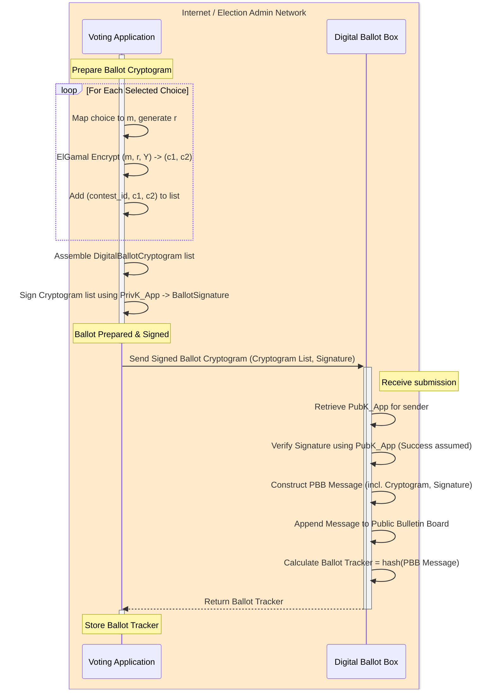

# Ballot Submission Subprotocol Sequence Diagram

```mermaid
sequenceDiagram
    box rgb(255, 235, 204) Internet  / Election Admin Network
        participant VA as Voting Application
        participant DBB as Digital Ballot Box
    end

    activate VA
    Note over VA: Prepare Ballot Cryptogram
    loop For Each Selected Choice
        VA->>VA: Map choice to m, generate r
        VA->>VA: ElGamal Encrypt (m, r, Y) -> (c1, c2)
        VA->>VA: Add (contest_id, c1, c2) to list
    end
    VA->>VA: Assemble DigitalBallotCryptogram list
    VA->>VA: Sign Cryptogram list using PrivK_App -> BallotSignature
    Note over VA: Ballot Prepared & Signed
    deactivate VA

    VA->>+DBB: Send Signed Ballot Cryptogram (Cryptogram List, Signature)

    activate DBB
    Note right of DBB: Receive submission
    DBB->>DBB: Retrieve PubK_App for sender
    DBB->>DBB: Verify Signature using PubK_App (Success assumed)
    DBB->>DBB: Construct PBB Message (incl. Cryptogram, Signature)
    DBB->>DBB: Append Message to Public Bulletin Board
    DBB->>DBB: Calculate Ballot Tracker = hash(PBB Message)
    DBB-->>-VA: Return Ballot Tracker
    deactivate DBB

    activate VA
    Note over VA: Store Ballot Tracker
    deactivate VA
```
