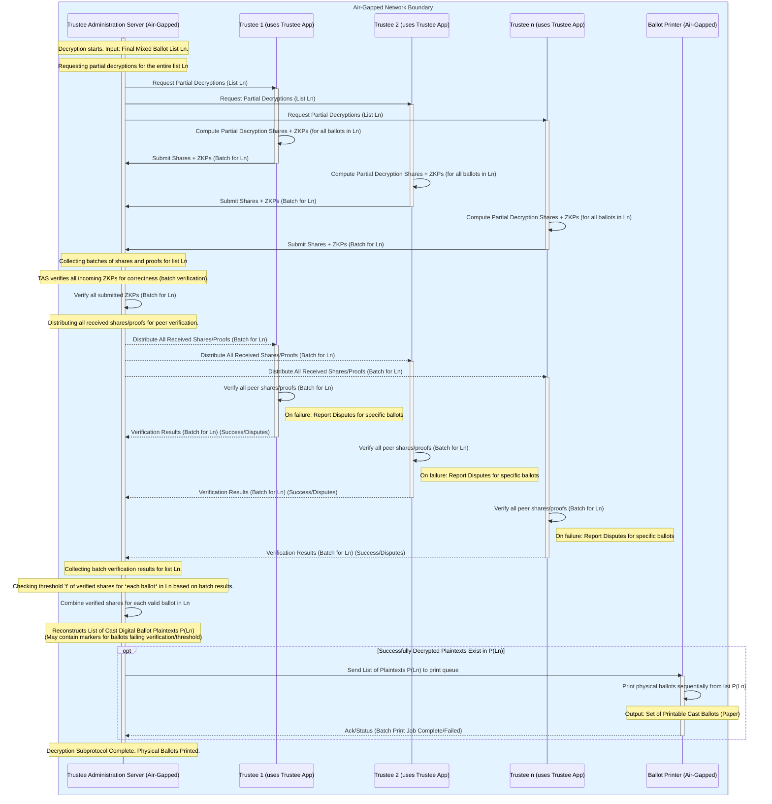

# Trustee Ballot Decryption Subprotocol Sequence Diagram

```mermaid
sequenceDiagram
    %% Define Participants within the Air-Gapped Network
    box rgb(227, 243, 255) Air-Gapped Network Boundary
        participant TAS as Trustee Administration Server (Air-Gapped)
        participant T1 as Trustee 1 (uses Trustee App)
        participant T2 as Trustee 2 (uses Trustee App)
        participant Tn as Trustee n (uses Trustee App)
        participant BP as Ballot Printer (Air-Gapped)
    end %% Air-Gapped Network Boundary

    activate TAS
    Note over TAS: Decryption starts. Input: Final Mixed Ballot List Ln.

    %% == Phase 1: Request Partial Decryption Shares for the List ==
    Note over TAS: Requesting partial decryptions for the entire list Ln
    TAS->>T1: Request Partial Decryptions (List Ln)
    activate T1
    TAS->>T2: Request Partial Decryptions (List Ln)
    activate T2
    TAS->>Tn: Request Partial Decryptions (List Ln)
    activate Tn

    %% == Phase 2: Compute & Submit Partial Decryption Shares for the List ==
    T1->>T1: Compute Partial Decryption Shares + ZKPs (for all ballots in Ln)
    T1->>TAS: Submit Shares + ZKPs (Batch for Ln)
    deactivate T1

    T2->>T2: Compute Partial Decryption Shares + ZKPs (for all ballots in Ln)
    T2->>TAS: Submit Shares + ZKPs (Batch for Ln)
    deactivate T2

    Tn->>Tn: Compute Partial Decryption Shares + ZKPs (for all ballots in Ln)
    Tn->>TAS: Submit Shares + ZKPs (Batch for Ln)
    deactivate Tn
    Note over TAS: Collecting batches of shares and proofs for list Ln

    %% == Phase 3: Verify Submitted Shares (Server & Peer) for the List ==
    Note over TAS: TAS verifies all incoming ZKPs for correctness (batch verification).
    TAS->>TAS: Verify all submitted ZKPs (Batch for Ln)

    Note over TAS: Distributing all received shares/proofs for peer verification.
    TAS-->>T1: Distribute All Received Shares/Proofs (Batch for Ln)
    activate T1
    TAS-->>T2: Distribute All Received Shares/Proofs (Batch for Ln)
    activate T2
    TAS-->>Tn: Distribute All Received Shares/Proofs (Batch for Ln)
    activate Tn

    T1->>T1: Verify all peer shares/proofs (Batch for Ln)
    Note right of T1: On failure: Report Disputes for specific ballots
    T1-->>TAS: Verification Results (Batch for Ln) (Success/Disputes)
    deactivate T1

    T2->>T2: Verify all peer shares/proofs (Batch for Ln)
    Note right of T2: On failure: Report Disputes for specific ballots
    T2-->>TAS: Verification Results (Batch for Ln) (Success/Disputes)
    deactivate T2

    Tn->>Tn: Verify all peer shares/proofs (Batch for Ln)
    Note right of Tn: On failure: Report Disputes for specific ballots
    Tn-->>TAS: Verification Results (Batch for Ln) (Success/Disputes)
    deactivate Tn
    Note over TAS: Collecting batch verification results for list Ln.

    %% == Phase 4: Combine Shares & Reconstruct Plaintexts for the List ==
    Note over TAS: Checking threshold 't' of verified shares for *each ballot* in Ln based on batch results.
    TAS->>TAS: Combine verified shares for each valid ballot in Ln
    Note over TAS: Reconstructs List of Cast Digital Ballot Plaintexts P(Ln) <br/> (May contain markers for ballots failing verification/threshold)

    %% == Phase 5: Print Ballots from the List ==
    opt Successfully Decrypted Plaintexts Exist in P(Ln)
        TAS->>BP: Send List of Plaintexts P(Ln) to print queue
        activate BP
        BP->>BP: Print physical ballots sequentially from list P(Ln)
        Note over BP: Output: Set of Printable Cast Ballots (Paper)
        BP-->>TAS: Ack/Status (Batch Print Job Complete/Failed)
        deactivate BP
    end

    Note over TAS: Decryption Subprotocol Complete. Physical Ballots Printed.
    deactivate TAS
```
