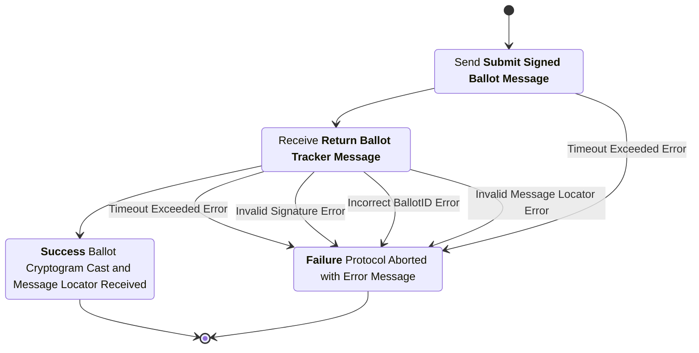
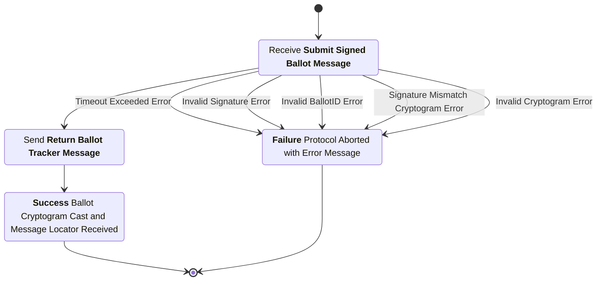

# Ballot Casting Subprotocol
This subprotocol defines the interaction between the voting application and the digital ballot box to mark as cast a previously submitted ballot.

## Phase 1: Request to Cast

### Cast Request Message
sender
: Voting Application (VA)

recipient
: Digital Ballot Box (DBB)

purpose
: Inform the digital ballot box which ballot the voting application is requesting to cast and provide a non-reputable digital attestation that the voting application has requested this action take place.

***structure***
```rust
struct CastReqMsg {
  election_hash : String, // Hash of the unique election configuration item.
  voter_pseudonym : String, // Unique identifier for the voter.
  voter_public_key : String, // Public key associated with this voting session.
  ballot_tracker : String, // The unique identifier of the ballot cryptogram to be cast.
  signature : String, // A digital signature created by the voting applications's signing key over the contents of this message.
}
```

### Cast Request Checks
1. The `election_hash` is the hash of the election configuration item for the current election.
2. The `voter_pseudonym` and `voter_public_key` match a stored `AuthVoterMsg` from the EAS.
3. The `ballot_tracker` matches a previously published `BallotSubBulletin` entry on the public bulletin board and the `election_hash`, `voter_pseudonym`, and `voter_public_key` from this message match the corresponding elements of the `BallotSubBulletin` entry.
4. There are no previously published `BallotCastBulletin` entries on the public bulletin board with the same `voter_pseudonym`.
5. The `BallotSubBulletin` corresponding to the `ballot_tracker` is the most recent such entry on the bulletin board with this `voter_pseudonym`.
6. The `signature` is a valid signature over the message contents signed by the `voter_public_key` signing key.


### Voter Authorization Bulletin
Once the *Cast Request Checks* have been completed successfully, the digital ballot box appends this entry to the public bulletin board. This entry serves to permanently record the authorization of a signing key and voter pseudonym provided by the election administration server using a tamper evident data structure. For clarification, this is the same voter authorization message from the election administration server previously received and used when validating ballot submissions. The voter authorization was not published to the bulletin board until now, after all casting checks have been completed and directly prior to a ballot casting, so as to support multiple authorizations yet ensure only one key is ever authorized when casting a ballot to aid in universal verifiability.

***structure***
```rust
struct VoterAuthBulletin {
  message_type : enum, // Message type identifier
  election_hash : String, // Hash of the unique election configuration item.
  timestamp : u64, // Timestamp of when the DBB processed the submission
  authorization : AuthVoterMsg, // Signed voter authorization message from EAS.
  previous_bb_msg_hash : String, // Hash of the last message posted to the bulletin board
  signature : String, // Signature over the contents of the message by the digital ballot box signing key.
}
```

### Ballot Cast Bulletin
Once the *Voter Authorization Bulletin* has been posted, the casting of the selected ballot can proceed. The digital ballot box appends this entry to the public bulletin board. This entry officially casts the ballot on behalf of the voter for this election. this process can only occur once per voter and is unable to be canceled once completed. The casting bulletin serves to permanently record the voter's ballot choices as cast using a tamper evident data structure.

***structure***
```rust
struct VoterAuthBulletin {
  message_type : enum, // Message type identifier
  election_hash : String, // Hash of the unique election configuration item.
  timestamp : u64, // Timestamp of when the DBB processed the submission
  ballot : SignedBallotMsg, // Signed Ballot Message submitted earlier matching the ballot tracker in the cast request.
  cast_intent : CastReqMsg, // Signed voter cast request message from the VA.
  previous_bb_msg_hash : String, // Hash of the last message posted to the bulletin board
  signature : String, // Signature over the contents of the message by the digital ballot box signing key.
}
```


## Phase 2: Confirm Cast
Once the digital ballot box has validated the cast request against the appropriate validation checks and written the cast message to the public bulletin board this phase begins.

### Cast Confirmation Message
sender
: Digital Ballot Box (DBB)

recipient
: Voting Application (VA)

purpose
: Confirm to the voting application that the ballot has been successfully cast and provide the voting application with a locater for the public bulletin board message where the casting message was written.

***structure***
```rust
struct CastConfMsg {
  election_hash : String, // Hash of the unique election configuration item.
  ballot_sub_tracker : String, // The unique identifier of the submitted ballot bulletin on the PBB.
  ballot_cast_tracker : String, // The unique identifier of the casting bulletin on the PBB.
  signature : String, // A digital signature created by the digital ballot box's signing key over the contents of this message.
}
```

## Voting Application Process Diagram


## Digital Ballot Box Process Diagram

