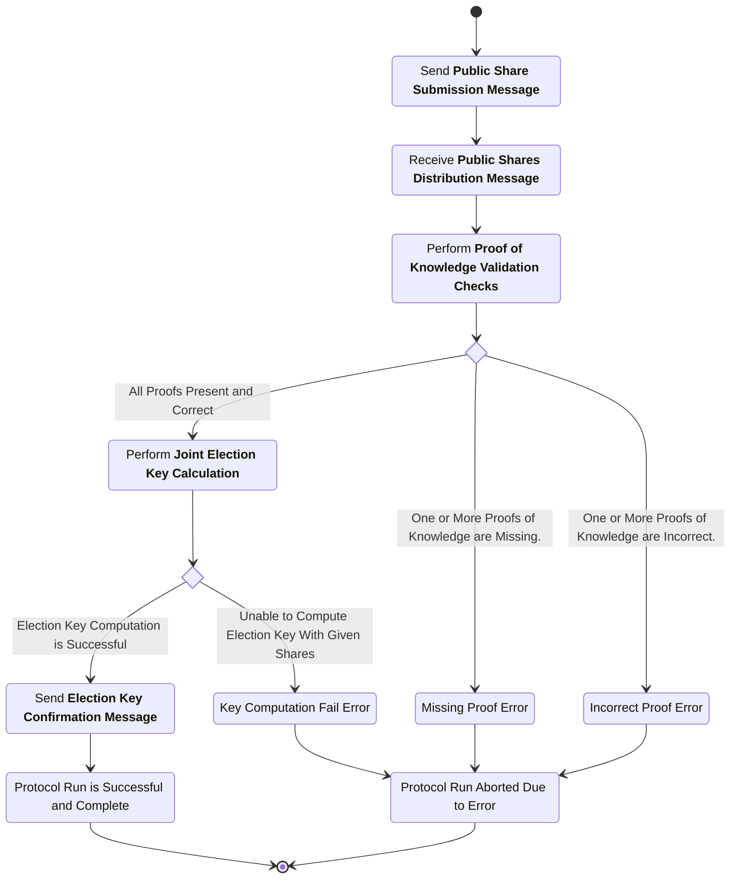
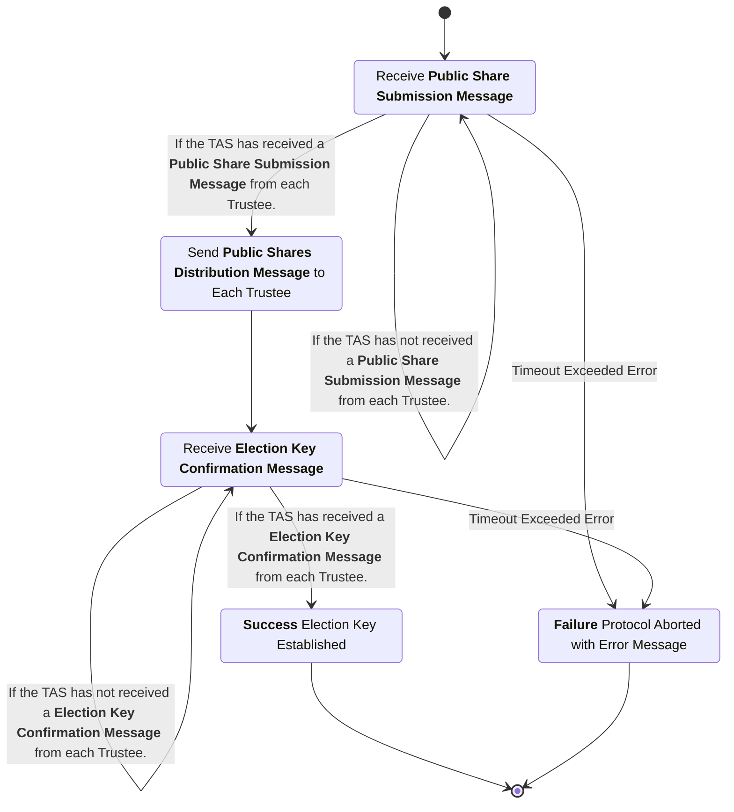

# Election Key Generation Subprotocol
This subprotocol defines the interactions between the trustees and the trustee administration server to accomplish the distributed generation of a public key with each trustee holding a private key share. When ballots are later encrypted they are encrypted using this election public key.

## Phase 1: Collect Public Shares and Proofs

### Public Share Submission Message
sender
: Trustee

recipient
: Trustee Administration Server (TAS)

purpose
: Transmit a single trustee's public share and proof of knowledge of the corresponding private share to the Trustee Administration Server.

***structure***
```rust
struct PublicShareSubmissionMessage {
  election_hash : String,
  public_share : String,
  proof_of_knowledge : String,
  public_key : String,
  signature : String,
}
```
- `election_hash`: Hash of the unique election configuration item.
- `public_share`: The public share generated by the trustee.
- `proof_of_knowledge`: The proof of knowledge demonstrating the trustee has knowledge of the private share associated with the public share included in this message.
- `public_key`: Public signing key associated with this trustee.
- `signature`: A digital signature created by the trustee's signing key over the contents of this message.

channel properties
: The `signature` is intended to provide integrity and authenticity over the contents of the message namely the public share and proof of knowledge.


### Public Share Submission Message Checks
1. The `election_hash` is the hash of the election configuration item for the current election.
2. The fields `public_share` and `proof_of_knowledge` are present and of a valid format.
3. The `public_key` is a valid signature key for a Trustee in this election.
4. The `signature` is a valid signature matching the `public_key` over the contents of this message minus the signature itself.

Note: The Trustee Administration Server could check the correct construction of the `public_share` and the validity of the `proof_of_knowledge`. However, this responsibility is *intentionally* left to the other Trustees participating in the distributed key generation process.


## Phase 2: Distribute Collected Shares and Proofs

### Public Shares Request Message
sender
: Trustee

recipient
: Trustee Administration Server (TAS)

purpose
: Request all **Public Share Submission Message**s the trustee administration server has received so far.

***structure***
```rust
struct PublicSharesRequestMessage {
  election_hash : String,
  public_key : String,
}
```
- `election_hash`: Hash of the unique election configuration item.
- `public_key`: Public signing key associated with this trustee.

channel properties
: There are no special properties assumed of this channel. This message is merely pinging the server to request data.


### Public Shares Request Message Checks
1. The `election_hash` is the hash of the election configuration item for the current election.
2. The `public_key` is a valid signature key for a Trustee in this election.


### Public Shares Distribution Message
sender
: Trustee Administration Server (TAS)

recipient
: Trustee

purpose
: Transmit all **Public Share Submission Message**s the trustee administration server has received so far in response to a **Public Shares Request Message**.

***structure***
```rust
struct PublicSharesDistributionMessage {
  election_hash : String,
  share_list : List<PublicShareSubmissionMessage>,
  signature : String,
}
```
- `election_hash`: Hash of the unique election configuration item.
- `share_list`: List of all Public Share Submission Messages received so far.
- `signature`: Signature by the Trustee Administration Server's signing key.

channel properties
: The `signature` by the Trustee Administration Server is intended to provide authenticity and integrity over the list of **Public Share Submission Messages**.


### Public Shares Distribution Message Checks

#### Message Checks
1. The `election_hash` is the hash of the election configuration item for the current election.
2. The `signature` is a valid signature matching the public signing key of the Trustee Administration Server.

#### Public Share Checks
For each PublicShareSubmissionMessage in the `share_list` the following checks are performed:
1. The `election_hash` is the hash of the election configuration item for the current election.
2. The `public_share` is a valid public share for the asymmetric encryption scheme.
3. The `proof_of_knowledge` verifies correctly given the public share in this message.
4. The `public_key` is a valid signature key for a Trustee in this election.
5. The `signature` is a valid signature matching the `public_key` over the contents of this message minus the signature itself.
6. This Trustee has not seen a different `public_share` signed by this `public_key` before.


### All Public Shares Received Event
Once a trustee has received all other Trustee's public shares from the Trustee Administration Server and all shares are valid this event occurs and the Trustee is ready to proceed to the next phase.


## Phase 3: Pairwise Secret Sharing

### Pairwise Shares Submission Message
sender
: Trustee

recipient
: Trustee Administration Server (TAS)

purpose
: Transfer all encrypted pairwise secret shares to the Trustee Administration Server for distribution to the other trustees.

***structure***
```rust
struct PairwiseSharesSubmissionMessage {
  election_hash : String,
  pairwise_shares : List<PairwiseShare>,
  sender_public_key : String,
  signature : String,
}

struct PairwiseShare {
  election_hash : String,
  recipient_public_key : String,
  ciphertext : String,
  proof_of_knowledge : String,
  sender_public_key : String,
  signature : String,
}
```
**PairwiseSharesSubmissionMessage**
- `election_hash`: Hash of the unique election configuration item.
- `pairwise_shares`: List of pairwise shares for the Trustee Administration Server to distribute.
- `sender_public_key`: Public signature key of the Trustee sending this message.
- `signature`: A digital signature created by the sending trustee's signing key over the contents of this message.

**PairwiseShare**
- `election_hash`: Hash of the unique election configuration item.
- `recipient_public_key`: Public signature key of the intended recipient of the pairwise share.
- `ciphertext`: Ciphertext containing the pairwise share of the key encrypted with the public encryption key of the recipient Trustee.
- `proof_of_knowledge`: Proof of knowledge associated with the ciphertext of the pairwise share.
- `sender_public_key`: Public signature key of the Trustee sending this message.
- `signature`: A digital signature created by the sending trustee's signing key over the contents of this share.

channel properties
: The `signature` of the `PairwiseSharesSubmissionMessage` intends to provide authenticity and integrity over the message contents ensuring the trustee administration server knows who submitted this list and that the list is unmodified. The `signature` in the `PairwiseShare` intends to provide authenticity and integrity over the ciphertext containing the pairwise share and its associated proof.


### Pairwise Shares Submission Message Checks

#### Message Checks
1. The `election_hash` is the hash of the election configuration item for the current election.
2. The fields `pairwise_shares` are present and of a valid format.
3. The `sender_public_key` is a valid signature key for a Trustee in this election.
4. The `signature` is a valid signature matching the `sender_public_key` over the contents of this message minus the signature itself.

#### Pairwise Share Checks
1. The `election_hash` is the hash of the election configuration item for the current election.
2. The `recipient_public_key` is a valid signature key for a Trustee in this election and is distinct from the `sender_public_key`.
3. A correctly formatted `ciphertext` is present.
4. A correctly formatted `proof_of_knowledge` is present.
5. The `sender_public_key` of the `PairwiseShare` matches the `sender_public_key` of the parent `PairwiseSharesSubmissionMessage`.
6. The `signature` is a valid signature matching the `sender_public_key` over the contents of the pairwise share minus the signature itself.
7. The list of pairwise shares contains one unique entry for each Trustee other than the Trustee which sent this message.

Note: The Trustee Administration Server could check the correct construction of the `pairwise_shares` and the validity of their associated proofs of knowledge. However, this responsibility is *intentionally* left to the other Trustees participating in the distributed key generation process.


### Pairwise Shares Request Message
sender
: Trustee

recipient
: Trustee Administration Server (TAS)

purpose
: Request all **PairwiseShares** the trustee administration server has received so far where this Trustee is the intended recipient.

***structure***
```rust
struct PairwiseSharesRequestMessage {
  election_hash : String,
  public_key : String,
}
```
- `election_hash`: Hash of the unique election configuration item.
- `public_key`: Public signature key of the Trustee sending this message.

channel properties
: There are no special properties assumed of this channel. This message is merely pinging the server to request data.


### Pairwise Shares Request Message Checks
1. The `election_hash` is the hash of the election configuration item for the current election.
2. The `public_key` is a valid signature key for a Trustee in this election.


### Pairwise Shares Distribution Message
sender
: Trustee Administration Server (TAS)

recipient
: Trustee

purpose
: Transmit all **PairwiseShares** the trustee administration server has received so far where the intended recipient matches the sender of the **Public Shares Request Message** which triggered this action.

***structure***
```rust
struct PairwiseSharesDistributionMessage {
  election_hash : String,
  recipient_public_key : String,
  pairwise_shares : List<PairwiseShare>,
  signature : String,
}
```
- `election_hash`: Hash of the unique election configuration item.
- `recipient_public_key`: Public signature key of the intended recipient of the list of pairwise shares.
- `pairwise_shares`: List of pairwise shares.
- `signature`: A digital signature created by the Trustee Administration Server's signing key over the contents of this message.

channel properties
: The `signature` intends to provide authenticity and integrity over the contents of this message namely the list of pairwise shares.


### Pairwise Shares Distribution Message Checks

#### Message Checks
1. The `election_hash` is the hash of the election configuration item for the current election.
2. The `recipient_public_key` is the public signing key of this Trustee.
3. The `pairwise_shares` list is present and of a valid format.
4. The `signature` is a valid signature matching the public signing key of the Trustee Administration Server over the contents of this message minus the signature itself.

#### Pairwise Share Checks
1. The `election_hash` is the hash of the election configuration item for the current election.
2. The `recipient_public_key` is the public signing key of this Trustee.
3. The `ciphertext` is able to be decrypted by this Trustee's private encryption key and the plaintext contains a well formed pairwise key share.
4. The `proof_of_knowledge` is valid and verifies correctly.
5. The `sender_public_key` a valid signature key for a Trustee in this election.
6. The `signature` is a valid signature matching the `sender_public_key` over the contents of the pairwise share minus the signature itself.
7. There are no duplicate `sender_public_key` fields in the list of Pairwise Shares.


## Phase 4: Election Public Key Confirmation

### Election Key Confirmation Message
sender
: Trustee

recipient
: Trustee Administration Server (TAS)

purpose
: An endorsement by each trustee of the public election key preventing an attack where some trustees are given a second false set of shares while the real election key is created without them. This would still be detectable but requiring matching signatures from all trustees side steps this problem.

***structure***
```rust
struct ElectionKeyConfirmationMessage {
  election_hash : String,
  election_public_key : String,
  public_key : String,
  signature : String,
}
```
- `election_hash`: Hash of the unique election configuration item.
- `election_public_key`: The election public key created by this distributed key generation process.
- `public_key`: The public signature key of the Trustee endorsing this election key.
- `signature`: A digital signature created by the signing key of the Trustee endorsing this election key over the contents of this message.

channel properties
: The `signature` intends to provide authenticity and integrity over the implied endorsement of the `election_public_key` included in this message.


### Election Key Confirmation Checks
1. The `election_hash` is the hash of the election configuration item for the current election.
2. The `election_public_key` matches the same in field in all other Trustee's `ElectionKeyConfirmationMessages`.
3. The `public_key` is a valid signature key for a Trustee in this election.
4. The `signature` is a valid signature matching the `public_key` over the contents of this message minus the signature itself.


### All Election Key Confirmations Received Event
The trustee administration server continues to listen for a **Election Key Confirmation Message** until the trustee administration server has collected one such message for each trustee. Once it has done so, this event occurs and the protocol is completed.


## Process Diagrams

### Trustee Process Diagram


### Trustee Administration Server Process Diagram

