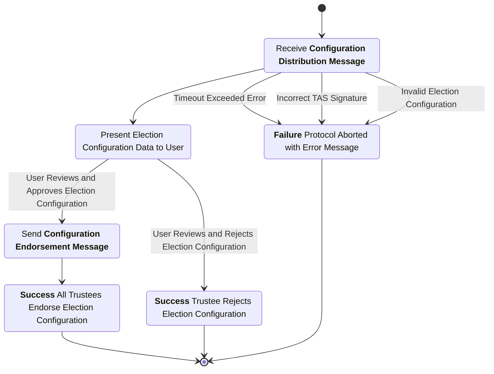
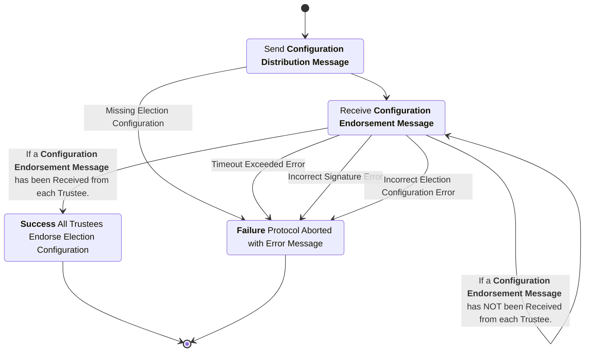

# Setup Subprotocol Specification
This subprotocol defines the interactions among the trustees and the trustee administration server to initialize the voting protocol. The purpose of this subprotocol is for all trustees to endorse an official configuration of the protocol for a particular election. This configuration includes the list of trustees and their associated public keys thereby establishing PKI for the Trustees.

## Phase 1: Configuration Distribution
In this phase the configuration for the election is distributed to each trustee for their inspection.

### Configuration Distribution Message
sender
: Trustee Administration Server (TAS)

recipient
: Trustee

purpose
: Transmit the proposed election configuration from the Trustee Administration Server to a Trustee.

***structure***
```rust
struct ConfigDistMsg {
    manifest : ElectionManifest,
    trustees : Vec<Trustee>,
    tas_signature : String,
}

struct Trustee {
    name : String,
    public_key : String,
}
```

channel properties
: The signature by the TAS included in this message serves to provide authenticity and integrity for the transmitted election configuration.


## Phase 2: Configuration Acceptance

### Configuration Endorsement Message
sender
: Trustee

recipient
: Trustee Administration Server (TAS)

purpose
: Sign the election configuration as a public endorsement by the Trustee signing the message. Included in this is the list of Trustees and their associated public keys there by providing a root to the public key infrastructure among the Trustees. Notably, the identities of the other Trustees and their associated public keys should be confirmed out of band before this message is signed and sent.

***structure***
```rust
struct ConfigEndorsMsg {
    public_key : String, // Public Key of the Trustee signing/endorsing the configuration
    signature : String, // Signature over the contents of the Configuration Distribution Message
}
```

channel properties
: The signature by the Trustee included in this message serves as an endorsement of the election configuration with non-repudiation of the endorsement along with integrity over the election configuration and authenticity with respect to who is endorsing this election configuration.

## Trustee Process Diagram


## Trustee Administration Server Process Diagram

