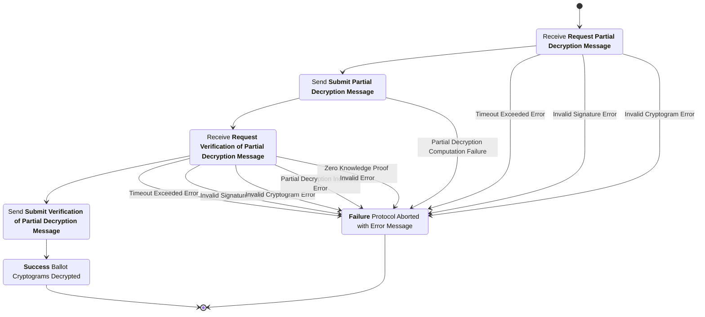
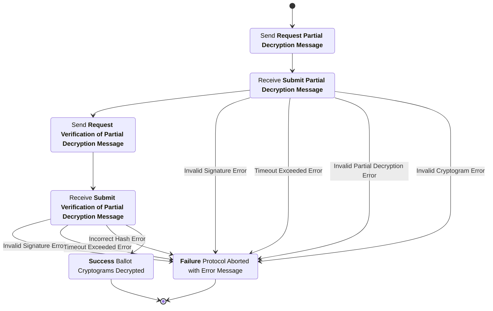

# Trustee Decryption Subprotocol
This subprotocol specifies the interactions between the trustees and the trustee administration server that transform the, already mixed, list of ciphertexts into a list of plaintexts, to be tallied.


## Phase 1: Partial Decryptions

### Request Partial Decryption Message

sender
: Trustee Administration Sever (TAS)

recipient
: Trustee

purpose
: Transmit a the list of un-decrypted ballot ciphertexts to each trustee so that an initial decryption can be performed.

***structure***
```rust
  struct RequestPartialDecryptionMessage {
    election_hash : String,
    cryptogram_list : List<Cryptogram>.
    signature : String,
  }
```
- `election_hash`: Hash of the unique election configuration item.
- `cryptogram_list`: The list of all ballot cryptograms accepted by the digital ballot box.
- `signature`: Signature by the Trustee Administration Server's signing key over the contents of this message minus the signature itself.

channel properties
: The `signature` by the Trustee Administration Server is intended to provide authenticity and integrity over the list of cryptograms.


### Request Partial Decryption Message Checks
1. The `election_hash` is the hash of the election configuration item for the current election.
2. The `cryptogram_list` contains only valid ballot constructions of the ballot styles in this election.
3. The `signature` is a valid signature matching the public signing key of the Trustee Administration Server.


### Submit Partial Decryption Message
sender
: Trustee

recipient
: Trustee Administration Server (TAS)

purpose
: Give the trustee administration server a list of partial decryptions along with a list of proofs of correct partial decryption.

***structure***
```rust
struct SubmitPartialDecryptionMessage {
  election_hash : String,
  partial_decryption_list : List<PartialDecryption>.
  public_key : String,
  signature : String,
}

struct PartialDecryption {
  decrypted_component : String,
  proof : String,
}
```
- `election_hash`: Hash of the unique election configuration item.
- `partial_decryption_list`: List of the partial decryptions generated by applying this Trustee's key share to the ciphertext and associated proofs.
- `public_key`: Public signature key belonging to this Trustee.
- `signature`: A digital signature created by the the Trustee's signature key over the contents of this message minus the signature itself.

channel properties
: The `signature` intends to provide authenticity and integrity over the contents of this message namely the list of partial decryptions.


### Submit Partial Decryption Message Checks
1. The `election_hash` is the hash of the election configuration item for the current election.
2. The `partial_decryption_list` contains a well formed partial decryption for each ciphertext in the list of cryptograms being decrypted.
3. The `public_key` is a valid signature key for a Trustee in this election.
4. The `signature` is a valid signature matching the `public_key` over the contents of this message minus the signature itself.

Note: The Trustee Administration Server could check the correct construction of the `PartialDecryption`s and the validity of their associated proofs. However, this responsibility is *intentionally* left to the other Trustees participating in the distributed decryption process.

## Phase 2: Verification of Partial Decryptions

### Request Verification of Partial Decryption Message
sender
: Trustee Administration Sever (TAS)

recipient
: Trustee

purpose
: Transmit the list of lists of partial decryptions and list of lists of proof of correct partial decryptions to each trustee for verification.

***structure***
```rust
struct RequestVerificationOfPartialDecryptionMessage {
  election_hash : String,
  partial_decryption_message_list : List<SubmitPartialDecryptionMessage>,
  signature : String,
}
```
- `election_hash`: Hash of the unique election configuration item.
- `partial_decryption_message_list`: List of all partial decryption messages the Trustee Administration Server has received.
- `signature`: Signature by the Trustee Administration Server's signing key over the contents of this message minus the signature itself.

channel properties
: The `signature` by the Trustee Administration Server is intended to provide authenticity and integrity over the list of partial decryption messages.


### Request Verification Of Partial Decryption Message Checks

#### Message Checks
1. The `election_hash` is the hash of the election configuration item for the current election.
2. The `partial_decryption_message_list` contains only valid partial decryption messages; from at least a threshold number of distinct Trustees.
3. Each `partial_decryption_list` within each `SubmitPartialDecryptionMessage` contains a well formed partial decryption for each ciphertext in the list of cryptograms being decrypted.
3. The `signature` is a valid signature matching the public signing key of the Trustee Administration Server.

#### Partial Decryption Checks
1. The `decrypted_component` is a valid partial decryption of the corresponding ciphertext.
2. The `proof` verifies correctly demonstrating the secret share for the trustee who generated the partial decryption was used in creating the decrypted_component.


### Submit Verification of Partial Decryption Message
sender
: Trustee

recipient
: Trustee Administration Server (TAS)

purpose
: Give the trustee administration server an attestation that this trustee asserts that they have successfully computed checks on all partial decryptions and proofs of correctness.

***structure***
```rust
struct SubmitVerificationOfPartialDecryptionMessage {
  election_hash : String,
  ballot_plaintext_list : List<String>,
  public_key : String,
  signature : String,
}
```
- `election_hash`: Hash of the unique election configuration item.
- `ballot_plaintext_list`: List of the decrypted ciphertexts using the combination of a threshold or greater number of partial decryption components.
- `public_key`: Public signature key belonging to this Trustee.
- `signature`: A digital signature created by the the Trustee's signature key over the contents of this message minus the signature itself.

channel properties
: The `signature` intends to provide authenticity and integrity over the contents of this message namely the list of decrypted plaintexts.


### Submit Verification of Partial Decryption Message Checks
1. The `election_hash` is the hash of the election configuration item for the current election.
2. The `ballot_plaintext_list` contains a list of plaintexts corresponding to the initial list of ballot cryptograms the protocol was initiated with. Each plaintext ballots has the same ballot style as its corresponding cryptogram.
3. The `public_key` is a valid signature key for a Trustee in this election.
4. The `signature` is a valid signature matching the `public_key` over the contents of this message minus the signature itself.


## Phase 3: Completion

### Signed Plaintexts Received Event
Once the trustee administration server receives a threshold number of Submit Verification of Partial Decryption Messages attesting to a common list of decrypted plaintext ballots, the protocol is now complete and the ballots can be tallied electronically or they can be printed and tallied with optical scanners, but this falls outside the scope of the protocol.

## Trustee Process Diagram


## Trustee Administration Server Process Diagram

