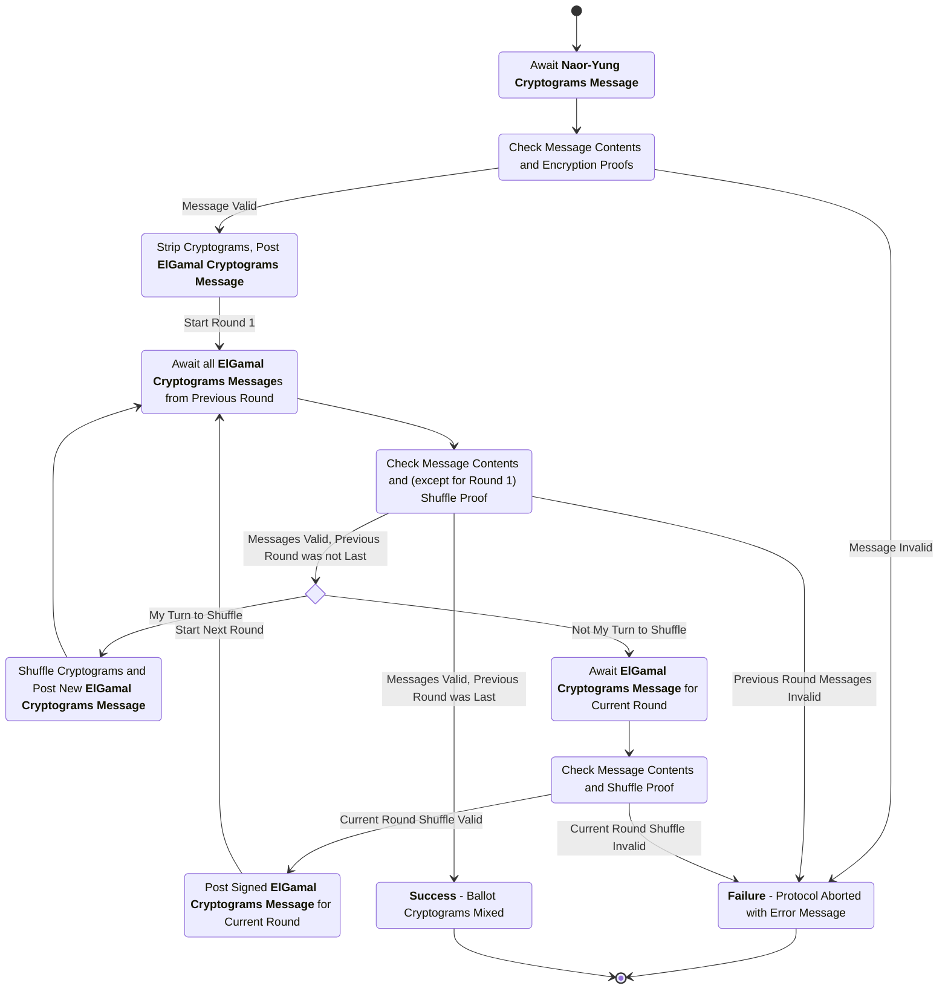
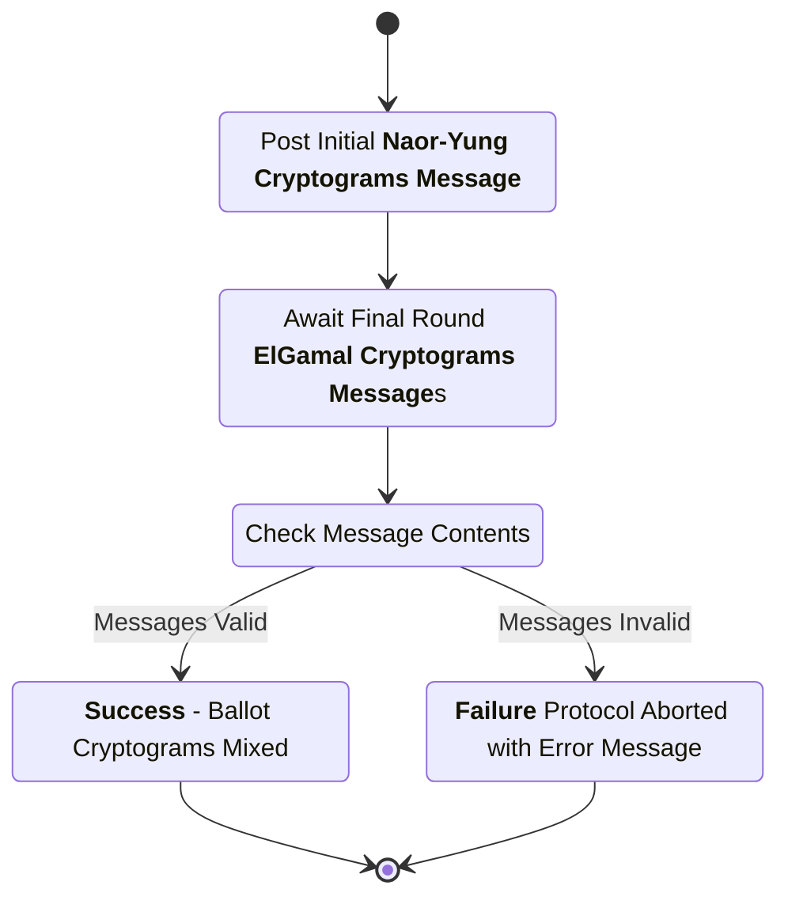

# Trustee Mixing Subprotocol

This subprotocol defines the interactions between the trustees and the trustee administration server (TAS) to accomplish the verified mixing of ballot ciphertexts through the use of a distributed re-encryption mixnet.

## Trustee Protocol Communication

As with the election key generation protocol, the TAS performs minimal computation in this protocol. It performs two main functions: providing a "trustee board" on which the trustees can post protocol messages, and posting an initial message to the trustee board containing the set of encrypted ballots that needs to be mixed.

 It exists to perform two main functions: providing a "trustee board" on which the trustees can post protocol messages, and posting the message to the trustee board containing the initial set of encrypted ballots that needs to be mixed.

More information on the trustee board mechanism is avaiable in the [election key protocol specification](./election-key-gen-spec.md).

This protocol requires the trustees to perform their individual shuffles in an order that is known to all the trustees (so that each trustee knows when it is their turn to shuffle). The mechanism for this ordering is implementation-dependent; possible implementations include lexicographic ordering of the trustee public keys, lexicographic ordering of trustee names, an assignment of numbers to the trustees performed as part of the initial election setup, etc. Here, we will simply assume that such an ordering exists.

Note that the fact that such an ordering exists and the trustees know it implies that the trustees know the entire set of participating trustees, and that the set of participating trustees cannot change _during_ the protocol execution without causing the protocol to fail. The set of participating trustees is provided to all the participating trustees out of band (though the initial protocol message posted by the TAS could also be extended to provide it).

## Phase 1: Post Initial Cryptograms

In this phase of the protocol. the TAS posts the initial list of Naor-Yung cryptograms to the trustee board. Only one message is posted in this phase.

### Naor-Yung (NY) Cryptograms Message

sender
: Trustee Administration Server (TAS)

recipient
: All Participating Trustees

board slot
: (`message_type`) (only one `NYCryptograms` message can be posted to the board)

purpose
: Provide the initial list of Naor-Yung cryptograms that need to be mixed, so that the trustees can verify their encryption proofs and strip them to ElGamal cryptograms for shuffling.

_**structure**_

```rust
struct NYCryptogramsMessage {
  message_type : enum,
  election_hash : String,
  cryptograms : List<NYCryptogram>,
  public_key : String,
  signature : String,
}
```

- `message_type`: The type of this message ("Naor-Yung cryptograms").
- `election_hash`: The hash of the unique election configuration item.
- `cryptograms`: The list of Naor-Yung cryptograms that need to be mixed.
- `public_key`: The public signing key associated with the TAS.
- `signature`: A digital signature created with the TAS's signing key over the contents of this message minus the signature itself.

channel properties
: The `signature` is intended to provide integrity and authenticity over the contents of this message.

#### Naor-Yung Cryptograms Message Checks

1. The `election_hash` is the hash of the election configuration item for the current election.
2. The `cryptograms` list contains a list of cryptograms valid for this election, and all of their encryption proofs are valid.
3. The `public_key` is the valid signing key for the TAS.
4. The `signature` is a valid signature matching the `public_key` over the contents of this message minus the signature itself.

## Phase 2: Trustees Validate Encryption Proofs and Post Stripped Cryptograms

In this phase, all participating trustees examine the initial set of Naor-Yung cryptograms posted by the TAS, performing all the message checks described above. Each one then strips the cryptograms to ElGamal cryptograms for shuffling and posts them to the trustee board. In a correct execution of the protocol, there are `K` (the number of participating trustees) messages posted in this phase, and their contents are identical aside from the `public_key` and `signature` fields. Note that the `public_key` is included in the content being signed.

Note that the `EGCryptogramMessage` defined below is the only message type used by the trustees for the remainder of this subprotocol.

### ElGamal (EG) Cryptograms Message

sender
: Participating Trustee

recipient
: All Participating Trustees

board slot
: (`message_type`, `original_message_source`, `public_key`)

purpose
: Post a list of shuffled (or initial, in the case of the first round) ElGamal cryptograms and corresponding shuffle proof (except in the first round).

_**structure**_

```rust
struct EGCryptogramsMessage {
  message_type : enum,
  election_hash : String,
  original_message_source : String,
  cryptograms : List<EGCryptogram>,
  shuffle_proof: ShuffleProof,
  public_key : String,
  signature : String
}
```

- `message_type`: The type of this message ("ElGamal cryptograms").
- `election_hash`: The hash of the unique election configuration item.
- `original_message_source` : The public signing key of the trustee (or TAS, in the case of the stripped initial cryptograms) that performed the shuffle to generate the list of cryptograms and shuffle proof (or the initial posting of the cryptograms) in this message; that is, the protocol actor that first sent the list of cryptograms and shuffle proof in this message.
- `cryptograms`: The list of shuffled (or stripped initial) cryptograms.
- `shuffle_proof` : The shuffle proof corresponding to the `cryptograms` list; this is empty for the message with the stripped initial cryptograms.
- `public_key` : The public signing key of the trustee signing this message. Note that if this trustee is sending the message initally, this must be identical to `original_message_source`.
- `signature`: A digital signature created with the signing key corresponding to `public_key` over the contents of this message minus the signature itself.

### ElGamal Cryptograms Message Checks

1. The `election_hash` is the hash of the election configuration item for the current election.
2. The `original_message_source` is the TAS or a trustee participating in this subprotocol, and is not the same as the `original_message_source` from any previous protocol phase.
3. The `cryptograms` list contains a list of cryptograms valid for this election.
4. The `cryptograms` list is identical to the `cryptograms` list in every other `EGCryptogramMessage` with the same `original_message_source`.
5. The `shuffle_proof`, for any original message source other than the TAS (the source of the stripped initial cryptograms), is a valid shuffle proof for the `cryptograms` list.
6. The `public_key` is a valid signing key for a trustee participating in this subprotocol.
7. The `signature` is a valid signature matching the `public_key` over the contents of this message minus the signature itself.

## Phases 3 .. (K + 2): Trustee Mixing and Mix Verification

In each subsequent phase, each trustee performs the `EGCryptogramsMessage` checks described above. One trustee determines (based on the `original_message_source` from the `EGCryptograms` messages in the previous phase) that it is their turn to shuffle, then shuffles the `cryptograms` list from the previous phase (which was identical across all the messages posted in that phase). Finally, they post an `EGCryptogramsMessage` with the shuffled cryptograms and the shuffle proof, using their identity as the `original_message_source` and including their own `public_key` and corresponding `signature`.

The other trustees, who determined that it was not their turn to shuffle, await the message from the shuffling trustee; when it is posted, each non-shuffling trustee performs all the message checks described above, and if they pass, generates an `EGCryptogramsMessage` with identical contents, but with its own `public_key` and `signature`, and posts it. Note that the `public_key` is always included in the content being signed.

Thus, in each of these phases, `K` messages are posted. In a correct run of the protocol, all `K` messages in the same phase have identical content other than the `public_key` and `signature`.

At the end of a successful phase `K + 2`, there are `K` messages with identical content (aside from signing trustee key and signature) on the trustee board with the last shuffling trustee as the `original_message_source`. When this occurs, the mixing subprotocol is complete. If the messages do not have identical content, the mixing subprotocol fails.

## Protocol Diagrams

Note that, in these diagrams, a trustee "awaits" a message by waiting until the specified message appears on its local copy of the trustee board. Any "await" state can cause the protocol to fail if the message does not arrive within some reasonable amount of time, but these timeouts are not explicitly listed in the state diagram.

## Trustee Process Diagram



## Trustee Administration Server Process Diagram


