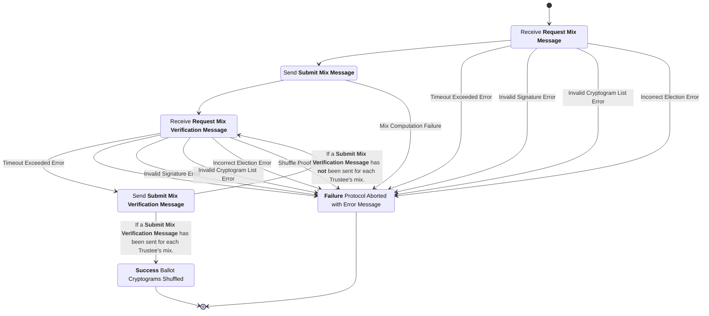
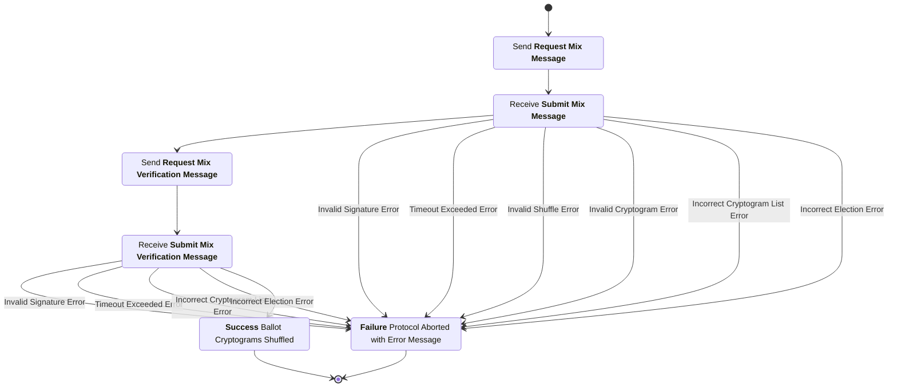

# Trustee Mixing Subprotocol
This subprotocol defines the interactions between the trustees and the trustee administration server to accomplish the verified mixing of ballot ciphertexts through the use of a distributed mixnet.

## Phase 1: Mix Cryptograms

### Request Cryptograms Message
sender
: Trustee

recipient
: Trustee Administration Server (TAS)

purpose
: Request the list of cryptograms this Trustee is slated to shuffle from the Trustee Administration Server.

***structure***
```rust
struct RequestCryptogramsMessage {
  election_hash : String,
  public_key : String,
  signature : String,
}
```
- `election_hash`:  Hash of the unique election configuration item.
- `public_key`: Public signature key belonging to this Trustee.
- `signature`: A digital signature created by the the Trustee's signature key over the contents of this message minus the signature itself.


### Request Cryptograms Message Checks
1. The `election_hash` is the hash of the election configuration item for the current election.
2. The `public_key` is a valid signature key for a Trustee in this election.
3. The `signature` is a valid signature matching the `public_key` over the contents of this message minus the signature itself.


### Distribute Cryptograms Message
sender
: Trustee Administration Server (TAS)

recipient
: Trustee

purpose
: Distribute to the Trustee the list of cryptograms they are slated to shuffle.

***structure***
```rust
struct DistributeCryptogramsMessage {
  election_hash : String,
  cryptograms : List<Cryptogram>
  signature : String,
}
```
- `election_hash`:  Hash of the unique election configuration item.
- `cryptograms`: List of cryptograms the recipient is slated to shuffle.
- `signature`: A digital signature created by the the Trustee Administration Server's signature key over the contents of this message minus the signature itself.


### Distribute Cryptograms Message Checks
1. The `election_hash` is the hash of the election configuration item for the current election.
2. The `cryptograms` list contains a list of cryptograms valid for this election.
3. The `cryptograms` list contains the unshuffled list of cryptograms if this is the first Trustee to shuffle otherwise it contains the list of cryptograms from the previous Trustee's shuffle.
4. The `signature` is a valid signature matching the signing key of the Trustee Administration Server over the contents of this message minus the signature itself.


### Submit Mixed Cryptograms Message
sender
: Trustee

recipient
: Trustee Administration Server (TAS)

purpose
: Submit the list of shuffled cryptograms and associated zero-knowledge proofs accomplishing this Trustee's active portion of the mix to the Trustee Administration Server for distribution to other Trustees enabling peer verification.

***structure***
```rust
struct SubmitMixedCryptogramsMessage {
  election_hash : String,
  shuffled_cryptograms : List<Cryptogram>,
  proofs : List<ShuffleProof>,
  public_key : String,
  signature : String,
}
```
- `election_hash`:  Hash of the unique election configuration item.
- `shuffled_cryptograms`: List of cryptograms shuffled and re-encrypted by this Trustee.
- `proofs`: List of shuffle proofs associated with the list of shuffled cryptograms in this message.
- `public_key`: Public signature key belonging to this Trustee.
- `signature`: A digital signature created by the the Trustee's signature key over the contents of this message minus the signature itself.


### Submit Mixed Cryptograms Message Checks
1. The `election_hash` is the hash of the election configuration item for the current election.
2. The `shuffled_cryptograms` field contains a list of cryptograms valid for this election which are re-encrypted such that this list has never been submitted by another Trustee.
3. The `proofs` field contains a list of shuffle proofs which are valid and verify with respect to the list of shuffled cryptograms in this message.
4. The `public_key` is a valid signature key for a Trustee in this election.
5. The `signature` is a valid signature matching the `public_key` over the contents of this message minus the signature itself.


## Phase 2: Verify Mix

### Request Mixed Cryptograms Message
sender
: Trustee

recipient
: Trustee Administration Server (TAS)

purpose
: Request the list of cryptograms and associated shuffle proofs from the Trustee Administration Server for peer verification.

***structure***
```rust
struct RequestMixedCryptogramsMessage {
  election_hash : String,
  public_key : String,
  signature : String,
}
```
- `election_hash`:  Hash of the unique election configuration item.
- `public_key`: Public signature key belonging to this Trustee.
- `signature`: A digital signature created by the the Trustee's signature key over the contents of this message minus the signature itself.


### Request Mixed Cryptograms Message Checks
1. The `election_hash` is the hash of the election configuration item for the current election.
2. The `public_key` is a valid signature key for a Trustee in this election.
3. The `signature` is a valid signature matching the `public_key` over the contents of this message minus the signature itself.


### Distribute Mixed Cryptograms Message
sender
: Trustee Administration Server (TAS)

recipient
: Trustee

purpose
: Distribute to the Trustee the list of shuffled cryptograms and associated proofs for peer verification.

***structure***
```rust
struct DistributeMixedCryptogramsMessage {
  election_hash : String,
  mix_message : SubmitMixedCryptogramsMessage,
  signature : String,
}
```
- `election_hash`:  Hash of the unique election configuration item.
- `mix_message`: The Submit Mixed Cryptograms Message sent by the Trustee containing the list of shuffled cryptograms and the associated zero-knowledge proofs.
- `signature`: A digital signature created by the the Trustee Administration Server's signature key over the contents of this message minus the signature itself.


### Distribute Cryptograms Message Checks
1. The `election_hash` is the hash of the election configuration item for the current election.
2. The `mix_message` is a valid Submit Mixed Cryptograms Message which passes all checks for that message type.
3. The `signature` is a valid signature matching the signing key of the Trustee Administration Server over the contents of this message minus the signature itself.


## Trustee Process Diagram


## Trustee Administration Server Process Diagram

