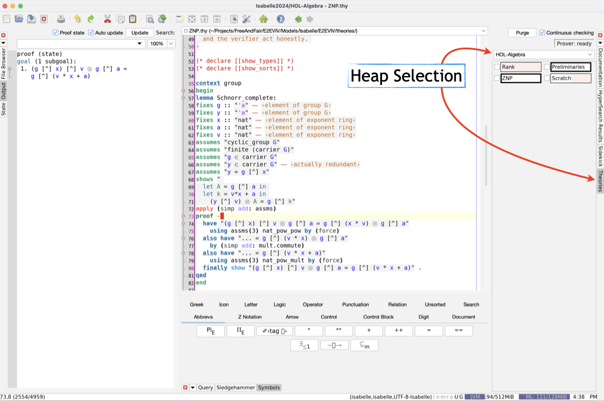

# Isabelle/HOL Theories for E2E-VIV Cryptography

@author Frank Zeyda</br>
@copyright Free & Fair 2025</br>
@version 0.1</br>
@license <span style="color:red">**TODO**</span></br>

## Description

This folder provides a collection of Isabelle/HOL theories that illustrate correctness proofs of a few relevant cryptographic protocols for E2E-VIV. The emphasis is to show how built-in libraries of Isabelle as well as material from the *Archive of Formal Proofs* ([AFP](https://www.isa-afp.org/)) can support such proofs with little mechanization effort of background concepts.

Currently, the content is very limited, only considering a simple example, i.e., of a completeness proof of Schnorr's **Zero Knowledge Proof** Protocol. During the course of the E2E-VIV Cryptography protocol formalization, it may be extended or not.

## Preliminaries

Please install Isabelle 2024 (or newer) for your system from:
- https://isabelle.in.tum.de/

Also the `make` utility and a reasonably complete LaTeX installation are required to build the Proof Document PDF.

## Browsing the Playing with the Theories

Browsing can be done without compilation of the `E2EVIV` session. Just start the Isabelle IDE, e.g., via `isabelle jedit`, change the default session (drop-down box in the *Theories* panel) to **HOL-Algebra**, and shut down and restart the Isabelle jEdit IDE. (Using *HOL-Algebra* as default heap prevents dynamic loading and compilation of the respective library theories.)  Then reopen the files under `E2EVIV/theories`.



Note that above can be circumvented by using the provided makefile with the target **openznp** (type `make openznp`). This starts `isabelle jedit` with suitable command-line options to (a) use the HOL-Algebra heap and (b) open the [ZNP.thy](E2EVIV/theories/ZNP.thy) theory.

Currently, the only theories available to study are:
- [Preliminaries](./E2EVIV/theories/Preliminaries.thy) (Preliminary Concepts)
- [ZNP](./E2EVIV/theories/ZNP.thy) (Zero Knowledge Proof Protocols)

## Compiling the Session Heap and Proof Document

This is most conveniently done using the included `Makefile`. If run without a target, it displays a short usage information:
```
Possible make commands are:
make install - installs E2EVIV location into Isabelle (run once)
make session - builds E2EVIV Isabelle heap and document
make openznp - opens ZNP.thy theory in jedit with the HOL-Algebra heap
make show    - displays the built proof document (PDF)
make clean   - cleans up LaTeX files of the proof document
```

Note that all dependent LaTeX style files from the [Verificatum EVS Draft](https://github.com/verificatum/evs-draft) necessary to build the Proof Document PDF are already included under the subfolder [E2EVIV/document](./E2EVIV/document) (see [E2EVIV/document/LATEX-NOTE.md](E2EVIV/document/LATEX-NOTE.md)). Thus, to build the Isabelle session heap and PDF, execute the following commands shell commands:
```
make install
make session
```

The first one (`make install`) adds the E2EVIV location to the search path for Isabelle components. It only needs to be executed once.

After `make session` completes without errors, the Proof Document PDF ought be available under [E2EVIV/output/document.pdf](E2EVIV/output/document.pdf). A new Isabelle heap image **E2EVIV** that includes all E2E-VIV Cryptography theories is moreover created. Note that compilation of the E2EVIV session heap *is not* required just to browse and experiment with the [E2EVIV theories](E2EVIV/theories), as these can be opened an loaded dynamically from inside `isabelle jedit` as described above.
