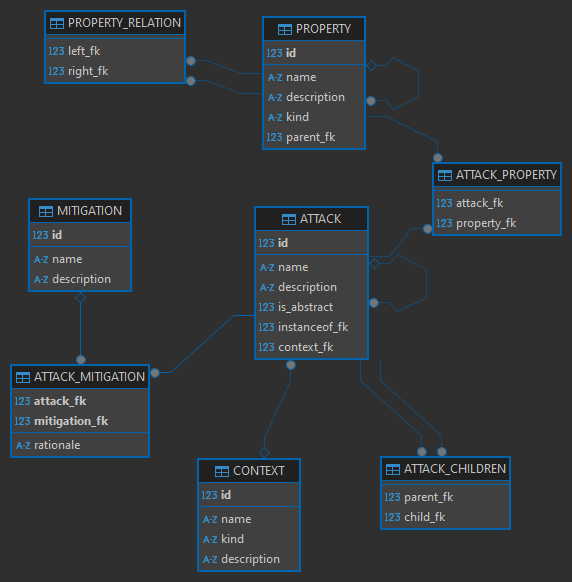

# Threat Model Database

This directory contains the scripts and sources that allow for generating and viewing of the threat model as a relational database. This database is the source of the static tables in the threat model document, as well as supporting command line views (with the [view.py](view.py) script) and an interactive browser view (with the [server.py](server.py) script).

The following describes the usage of the various scripts, which require a minimum Python version of 3.12.0. To install their dependencies before running them, use `pip install -r requirements.txt`.

## Parse

### Example

```
$ ./parse.py tm.yaml db.sqlite3
Inserts:
50 properties
29 contexts
124 attacks
16 mitigations (36 applied)
```

### Help

```
$ ./parse.py --help
usage: parse.py [-h] [--dry-run] yaml_file db_file

Parse YAML file and insert into DB (will be wiped).

positional arguments:
  yaml_file   Path to the YAML file
  db_file     Path to the SQLite database file

options:
  -h, --help  show this help message and exit
  --dry-run   Print the derived insert statements without executing them
```

## View (in Terminal)

### Example

```shell
$ ./view.py -e attack -r "Ballot tampering"
+----------------------+------------------------------------------------------+-----------+--------------+
| Attack               | Description                                          | Context   | Properties   |
+======================+======================================================+===========+==============+
| Ballot tampering     |                                                      | None      |              |
+----------------------+------------------------------------------------------+-----------+--------------+
| ├─Network tampering  | The network adds, alters or removes cryptograms.     | IN        | C2.1         |
+----------------------+------------------------------------------------------+-----------+--------------+
| ├─Network tampering  | The network adds, alters or removes cryptograms.     | EAN       | C2.1         |
+----------------------+------------------------------------------------------+-----------+--------------+
| ├─Compromised device | One or more subsystems alters or removes cryptogra.. | EAS       | C2.1         |
+----------------------+------------------------------------------------------+-----------+--------------+
| ├─Compromised device | One or more subsystems alters or removes cryptogra.. | BB        | C2.1         |
+----------------------+------------------------------------------------------+-----------+--------------+
| └─Corruption         | The election administrator alters or removes crypt.. | EA        | C2.1         |
+----------------------+------------------------------------------------------+-----------+--------------+
```

### Help

```shell
$ ./view.py --help
usage: view.py [-h] [-d [DATABASE]] [-t] [-e {property,context,mitigation,attack,outstanding}] [-r ROOT] [-o]

Display data in table or tree format.

options:
  -h, --help            show this help message and exit
  -d, --database [DATABASE]
                        Path to the SQLite database file
  -t, --tree            Display data in tree format
  -e, --entity {property,context,mitigation,attack,outstanding}
                        Specify the entity to display
  -r, --root ROOT       Specify the root entity by name
  -o, --oos             Show Out of scope "mitigations", for applicable views
  -a, --abstract        Show abstract attacks, for applicable views

Examples:
    ./view.py -e property                               # prints all properties table
    ./view.py -e property -t                            # prints all properties tree
    ./view.py -e property -t -r my_property             # prints properties tree, starting at my_property
    ./view.py -e attack                                 # prints all attacks table
    ./view.py -e attack -t                              # prints all attacks tree
    ./view.py -e attack -r my_attack                    # prints attacks table, starting at my_attack
    ./view.py -e mitigation                             # prints all mitigations table (broken)
    ./view.py -e mitigation -r my_attack                # prints mitigations table applied to my_attack
    ./view.py -e mitigation -r my_attack -t             # prints mitigations tree applied to my_attack (-o for oos)
    ./view.py -e context                                # prints all contexts
    ./view.py -e outstanding                            # prints all outstanding attacks
    ./view.py -e outstanding -r my_attack               # prints outstanding attacks starting at my_attack
    ./view.py -e mitigation -t -r my_attack      # prints mitigation path for attack my_attack
```

## View (in Browser)

To run the server for the browser view, start `./server.py` from this directory (after creating the database; it is expected to have filename `db.sqlite3`, though this can be overridden with a command line option). Then, browse to [http://127.0.0.1:8911/](http://127.0.0.1:8911) (the default port number can also be overridden with a command line option) and you should see the properties view, which has a navigation bar to getMay to the other views.

Note that when running in debugging mode, the server will output _a lot_ of information to the console, and when running in regular mode it will output almost nothing (unless errors occur).

### Help

```shell
$ ./server.py --help
usage: server.py [-h] [-d [DATABASE]] [-p [PORT]] [--debug]

Run server for interactive browser-based threat model view.

options:
  -h, --help            show this help message and exit
  -d [DATABASE], --database [DATABASE]
                        Path to the SQLite database file
  -p [PORT], --port [PORT]
                        Port on which to run the server
  --debug               Debugging mode
```

## Database Schema


