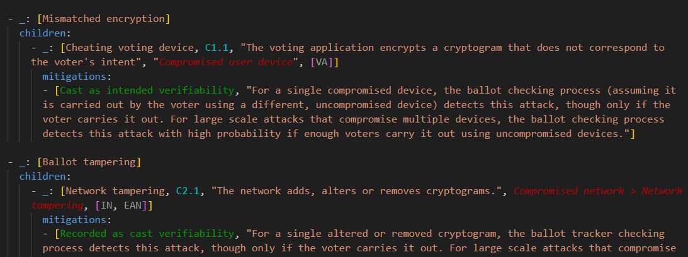

### Highlighting for yaml threat models

You can set up basic entity highlighting in vscode for editing yaml threat model files. This facilitates reading the file as well as getting cross-references right.



#### Installing

* [Install](https://code.visualstudio.com/docs/editor/extension-marketplace) these two vscode extensions

    * [TODO Highlight v2](https://github.com/jgclark/vscode-todo-highlight)
    * [Run on Save](https://github.com/emeraldwalk/vscode-runonsave)

*  Copy ```highlight_yaml.py``` and ```settings.<platform>.json``` to your ```.vscode``` project directory.

    Choose the ```settings.<platform>.json``` for your platform, and copy it to  ```./vscode/settings.json```. If you already have a ```settings.json``` file in your ```.vscode``` project directory, you will have to copy the entries in ```settings.<platform>.json``` into your existing file.

#### What it does

Properties, mitigations, contexts and abstract attacks are highlighted.

These highlights are not syntactic, they are derived from the content. Whenever the yaml file is saved, the required keywords will be automatically generated from the model. Alternatively you can generate the keywords once and then turn off the auto saving generation, by [disabling](https://github.com/emeraldwalk/vscode-runonsave?tab=readme-ov-file#commands) *run on save*, or simply setting:

```"match": "$^"```

found under ```emeraldwalk.runonsave``` in ```settings.json```. However if this is disabled new entities will not be highlighted (until it is enabled again).
